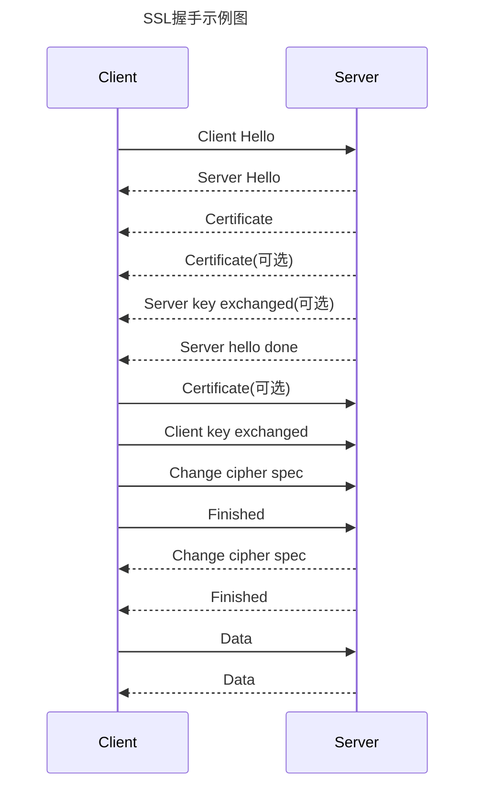

# Https协议运行过程

[toc]

#### SSL握手目的

* 验证服务端, 客户端
* 保证客户端和服务器加密算法一致

#### SSL握手示例图

#### SSL握手过程

##### 1. Client Hello

客户端向服务器发起请求, 包括支持的密码组. 密码组包含密码算法和大小.

发送的数据中包含一个随机数

##### 2. Server Hello

服务器选择客户和服务器支持的密码组到用户

发送的数据中包含一个随机数

##### 3. Certficate

服务器发送一个证书或者一个证书链到客户端, 一个证书链开始于服务器公共钥匙证书并结束于证明权威的根证书. 这个消息是可选的, 但服务器证书需要时, 必须使用

##### 4. Certificate Request(可选)

当服务器需要鉴别客户端时, 发送证书请求到客户端. 用于双端验证

##### 5. Server key exchange(可选)

服务器发来的公共钥匙对钥匙交换不是很充分时, 需要发送服务器钥匙交换消息, 主要为DH算法

##### 6. Server Hello Done

服务器通知客户端完成了初始化流通消息

##### 7. Certificate(可选)

如果服务器要求客户端证书, 需要客户端发送证书

##### 8. Client key exchange

客户产生用于对称算法的钥匙. 对RSA客户用服务器公钥加密这个钥匙信息, 并发送到服务器

生成一个随机数并用服务器公钥加密, 然后发送给服务器

##### 9. Change cipher spec

客户发告诉服务器已改变加密模式, 后续数据交互使用对称加密

##### 10. Finished

客户端告诉服务器已准备好加密通信

##### 11. Change cipher spec

服务器告诉客户端已改变加密模式, 后续数据交互使用对称加密

##### 12. Finished

服务器告诉客户端已改变加密模式, 后续数据交互使用对称加密, 为ssl握手最后一步

##### 13. Encrypted Data

传输数据